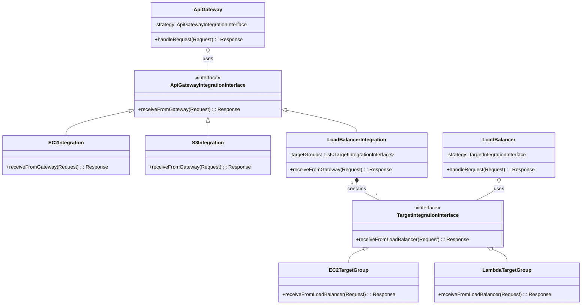
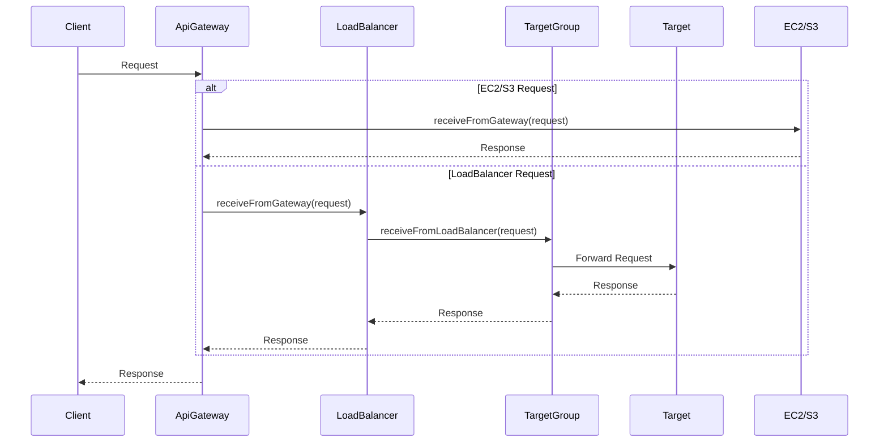

# AWS-SYS Design Documentation

## Composite Strategy Pattern Implementation

### Architecture Overview

The system implements a two-layer Composite Strategy Pattern for flexible request routing:

1. **Layer 1: API Gateway Routing**
   - **Strategy Interface**: `ApiGatewayIntegrationInterface`
     ```java
     public interface ApiGatewayIntegrationInterface {
         Response receiveFromGateway(Request request) throws Exception;
     }
     ```
   - **Concrete Strategies**: 
     - `EC2Integration`
     - `S3Integration`
     - `LoadBalancerIntegration`
   - **Context**: API Gateway

2. **Layer 2: Load Balancer Routing**
   - **Strategy Interface**: `TargetIntegrationInterface`
     ```java
     public interface TargetIntegrationInterface {
         Response receiveFromLoadBalancer(Request request) throws Exception;
     }
     ```
   - **Concrete Strategies**:
     - `EC2TargetGroup`
     - `LambdaTargetGroup`
   - **Context**: LoadBalancer

### Class Diagram



### Sequence Diagram



### Key Characteristics

1. **Layered Strategy**
   - Each layer handles a specific routing concern
   - Strategies can be composed (LoadBalancer contains TargetGroups)

2. **Extensibility**
   - Easy to add new integration types at either layer
   - New target types can be added without modifying existing code

3. **Maintainability**
   - Clear separation of concerns
   - Each component has a single responsibility

### Adding New Components

#### Adding a New API Gateway Integration
1. Implement `ApiGatewayIntegrationInterface`
2. Add routing logic in API Gateway

#### Adding a New Target Group Type
1. Implement `TargetIntegrationInterface`
2. Register with LoadBalancer

### Benefits of This Design

1. **Flexibility**: Easy to modify routing logic at any level
2. **Scalability**: New routing strategies can be added without affecting existing ones
3. **Testability**: Each strategy can be tested in isolation
4. **Maintainability**: Clear separation of concerns between routing layers
