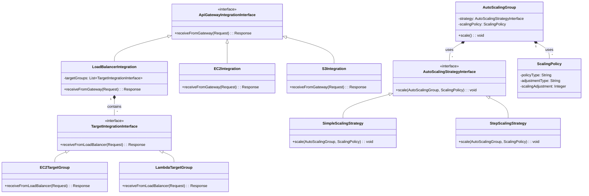
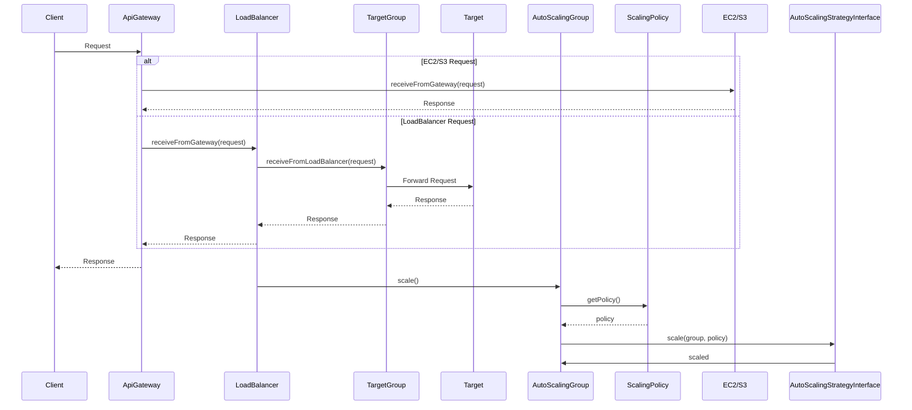
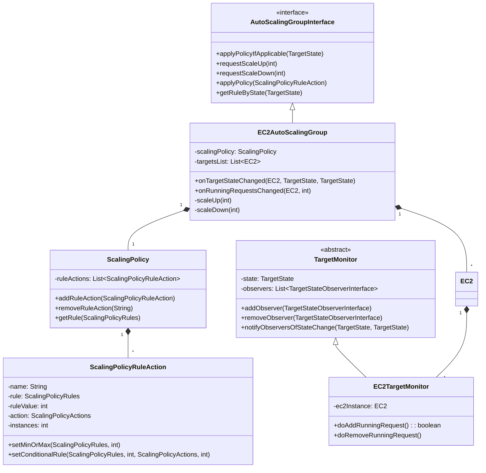
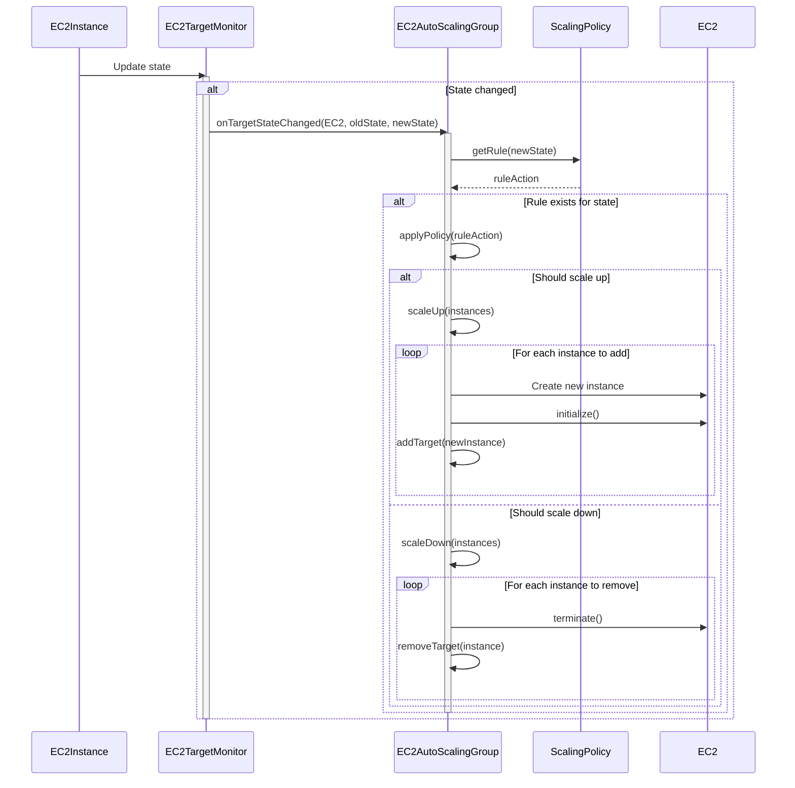

# AWS-SYS Design Documentation

## 1. EventBridge Architecture

### 1.1 Core Components

#### EventBridge
- Central event bus for managing and routing events
- Supports multiple named buses (e.g., "DEFAULT" bus)
- Handles event publication and rule evaluation

#### EventRule
- Defines event matching patterns (source, state)
- Contains target configuration for matched events
- Supports flexible event routing based on event attributes

#### EventTarget
- Represents event destinations
- Maintains a list of listeners for event delivery
- Handles fan-out to multiple listeners

#### EventBridgeListener
- Interface for components that can receive events
- Single method contract: `onEvent(AWSEvent event)`
- Implemented by components that need to react to events

### 1.2 Event Flow
1. **Event Creation**: Components create AWSEvent objects
2. **Event Publication**: Events are published to a specific event bus
3. **Rule Matching**: EventBridge evaluates rules against the event
4. **Target Invocation**: Matching rules trigger their associated targets
5. **Listener Notification**: Target notifies all registered listeners

### 1.3 Builder Pattern
- **EventRuleBuilder**: Simplifies creation of event rules
  ```java
  EventRule rule = new EventRuleBuilder()
      .withSource("ec2.amazonaws.com")
      .withDetailState("running")
      .withTarget(new EventTarget())
      .build();
  ```
- **EventBuilder**: (Planned) For constructing event objects

## 2. Composite Strategy Pattern Implementation

### Architecture Overview

The system implements a two-layer Composite Strategy Pattern for flexible request routing:

1. **Layer 1: API Gateway Routing**
   - **Strategy Interface**: `ApiGatewayIntegrationInterface`
     ```java
     public interface ApiGatewayIntegrationInterface {
         Response receiveFromGateway(Request request) throws Exception;
     }
     ```
   - **Concrete Strategies**: 
     - `EC2Integration`
     - `S3Integration`
     - `LoadBalancerIntegration`
   - **Context**: API Gateway

2. **Layer 2: Load Balancer Routing**
   - **Strategy Interface**: `TargetIntegrationInterface`
     ```java
     public interface TargetIntegrationInterface {
         Response receiveFromLoadBalancer(Request request) throws Exception;
     }
     ```
   - **Concrete Strategies**:
     - `EC2TargetGroup`
     - `LambdaTargetGroup`
   - **Context**: LoadBalancer

3. **Layer 3: Auto Scaling**
   - **Interface**: `AutoScalingStrategyInterface`
     ```java
     public interface AutoScalingStrategyInterface {
         void scale(AutoScalingGroup group, ScalingPolicy policy) throws Exception;
     }
     ```
   - **Context**: AutoScalingGroup

### Class Diagram



### Sequence Diagram



### Key Characteristics

1. **Layered Strategy**
   - Each layer handles a specific routing concern
   - Strategies can be composed (LoadBalancer contains TargetGroups)

2. **Extensibility**
   - Easy to add new integration types at either layer
   - New target types can be added without modifying existing code

3. **Maintainability**
   - Clear separation of concerns
   - Each component has a single responsibility

### Adding New Components

#### Adding a New API Gateway Integration
1. Implement `ApiGatewayIntegrationInterface`
2. Add routing logic in API Gateway

#### Adding a New Event Listener
1. Implement `EventBridgeListener` interface
2. Register with an `EventTarget`
3. Create appropriate `EventRule` to route events

#### Adding a New Target Group Type
1. Implement `TargetIntegrationInterface`
2. Register with LoadBalancer

#### Adding a New Auto Scaling Strategy
1. Implement `AutoScalingStrategyInterface`
2. Register with AutoScalingGroup

### Benefits of This Design

1. **Flexibility**: Easy to modify routing logic at any level
2. **Scalability**: New routing strategies can be added without affecting existing ones
3. **Testability**: Each strategy can be tested in isolation
4. **Maintainability**: Clear separation of concerns between routing layers

## 2. AutoScalingGroup and ScalingPolicy Components

### Architecture Overview

The AutoScaling system is built around the following key components:

1. **EC2AutoScalingGroup**: Manages a group of EC2 instances that can scale in/out based on defined policies.
2. **ScalingPolicy**: Defines the rules and actions for scaling the Auto Scaling Group.
3. **ScalingPolicyRuleAction**: Represents individual scaling rules with conditions and actions.
4. **TargetMonitor**: Monitors the state of EC2 instances and triggers scaling events.

### Class Diagram



### Sequence Diagram: Auto Scaling Flow



### Implementation Details

1. **EC2AutoScalingGroup**
   - Extends `EC2TargetGroup` and implements `AutoScalingGroupInterface`
   - Manages the lifecycle of EC2 instances in the auto-scaling group
   - Handles scaling operations based on policy rules
   - Monitors instance states and triggers appropriate scaling actions

2. **ScalingPolicy**
   - Maintains a collection of `ScalingPolicyRuleAction` objects
   - Validates rules to ensure consistency (e.g., min instances ≤ max instances)
   - Provides methods to add, remove, and query scaling rules

3. **ScalingPolicyRuleAction**
   - Defines the conditions and actions for scaling
   - Supports both simple (min/max) and conditional scaling rules
   - Validates rule parameters and ensures they meet requirements

4. **EC2TargetMonitor**
   - Monitors the state of individual EC2 instances
   - Tracks running requests and instance health
   - Notifies observers of state changes

### Usage Example

```java
// Create a scaling policy
ScalingPolicy policy = new ScalingPolicy("WebServerPolicy");

// Define min/max instances
ScalingPolicyRuleAction minRule = new ScalingPolicyRuleAction("MinInstances");
minRule.setMinOrMax(ScalingPolicyRules.MIN_INSTANCE, 2);

ScalingPolicyRuleAction maxRule = new ScalingPolicyRuleAction("MaxInstances");
maxRule.setMinOrMax(ScalingPolicyRules.MAX_INSTANCE, 10);

// Define scaling rules
ScalingPolicyRuleAction scaleUpRule = new ScalingPolicyRuleAction("ScaleUpOnHighCPU");
scaleUpRule.setConditionalRule(
    ScalingPolicyRules.OVERLOADED, // When CPU > 80%
    1,                             // If 1+ instances are overloaded
    ScalingPolicyActions.SCALE_UP, // Scale up
    2                              // Add 2 instances
);

// Add rules to policy
policy.addRuleAction(minRule);
policy.addRuleAction(maxRule);
policy.addRuleAction(scaleUpRule);

// Create EC2 instance
EC2 ec2 = new EC2(50, "web-server-1");

// Create Auto Scaling Group
EC2AutoScalingGroup asg = new EC2AutoScalingGroup(policy, "/web-servers", ec2);

// Initialize the ASG and start monitoring
asg.initialize();
```

### Key Features

1. **Flexible Scaling Rules**:
   - Define min/max instance counts
   - Create conditional rules based on instance states (HEALTHY, UNHEALTHY, OVERLOADED, etc.)
   - Support for both scale-up and scale-down actions

2. **Event-Driven Architecture**:
   - Monitors instance state changes and request counts
   - Automatically triggers scaling actions based on defined policies
   - Notifies observers of state changes

3. **Thread Safety**:
   - Uses thread-safe collections for managing instances
   - Implements proper synchronization for critical sections
   - Handles concurrent scaling operations gracefully

4. **Extensibility**:
   - Easy to add new scaling conditions and actions
   - Supports custom monitoring implementations
   - Pluggable policy system

### Best Practices

1. **Monitoring**:
   - Monitor key metrics like CPU, memory, and request queue depth
   - Set appropriate thresholds for scaling actions
   - Implement health checks to detect and replace unhealthy instances

2. **Scaling Policies**:
   - Define conservative scale-up and aggressive scale-down policies
   - Use cooldown periods to prevent rapid scaling fluctuations
   - Test scaling policies with realistic workloads

3. **Error Handling**:
   - Implement retry logic for failed scaling operations
   - Log all scaling events for auditing and troubleshooting
   - Set up alarms for failed scaling operations
